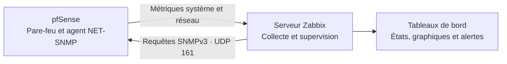

# pfsense-snmpv3-zabbix-monitoring
Supervision sécurisée d’un pare-feu pfSense avec SNMPv3 et Zabbix pour collecter, visualiser et surveiller les métriques réseau et système.
# Supervision réseau sécurisée avec pfSense, SNMPv3 et Zabbix


## Présentation

Ce projet personnel met en place une solution de supervision d'un pare-feu **pfSense** avec **Zabbix**. Le protocole **SNMPv3** est utilisé pour collecter de manière sécurisée les informations du système et du réseau, puis les afficher dans Zabbix sous forme d'états, de métriques et de graphiques.

L'objectif est de centraliser la visibilité sur pfSense afin de détecter plus rapidement une indisponibilité, une anomalie ou une dégradation des performances.

## Objectifs

- Installer et activer le paquet NET-SNMP sur pfSense.
- Configurer un agent SNMP avec la version SNMPv3.
- Créer un compte SNMPv3 dédié à la supervision.
- Ajouter pfSense comme hôte supervisé dans Zabbix.
- Collecter et visualiser les données réseau et système.
- Vérifier la disponibilité de l'agent et le bon fonctionnement de la remontée des métriques.

## Architecture



## Technologies utilisées

| Technologie | Rôle dans le projet |
|---|---|
| **pfSense Community Edition** | Pare-feu, routeur et équipement supervisé |
| **NET-SNMP** | Agent chargé d'exposer les métriques de pfSense |
| **SNMPv3** | Échange sécurisé des données de supervision avec authentification |
| **Zabbix 7.2** | Collecte, centralisation, visualisation et alertes |
| **VMware** | Environnement de virtualisation du laboratoire |

## Mise en œuvre

### 1. Préparation de pfSense

Le tableau de bord confirme le fonctionnement de pfSense dans l'environnement virtualisé avant l'intégration à la plateforme de supervision.


### 2. Installation de NET-SNMP

Le paquet **NET-SNMP** est installé depuis le gestionnaire de paquets de pfSense. Il fournit le service `snmpd` nécessaire pour répondre aux requêtes du serveur Zabbix.


### 3. Activation du service SNMP

Le service SNMP est activé dans pfSense. La configuration permet de définir l'interface d'écoute et utilise le port UDP **161**, port standard des requêtes SNMP.


### 4. Création d'un utilisateur SNMPv3

Un utilisateur dédié à Zabbix est créé dans NET-SNMP. L'utilisation d'un compte spécifique facilite le contrôle des accès et évite d'employer SNMPv1 ou SNMPv2c, qui reposent sur une simple chaîne de communauté.


> Les secrets d'authentification et de confidentialité ne doivent jamais être publiés dans le dépôt GitHub.

### 5. Ajout de pfSense dans Zabbix

Dans Zabbix, un nouvel hôte pfSense est créé avec :

- une interface de type **SNMP** ;
- l'adresse de l'équipement pfSense ;
- le port **161** ;
- la version **SNMPv3** ;
- un modèle pfSense adapté à la collecte SNMP.


### 6. Validation de la supervision

L'hôte pfSense apparaît comme activé et son interface SNMP est disponible. Zabbix reçoit des données et propose des éléments, des problèmes, des graphiques et un tableau de bord associés.


Les graphiques permettent ensuite de suivre l'évolution des indicateurs collectés, notamment la disponibilité de l'agent SNMP et différents services de pfSense.


## Données supervisées

Selon les éléments et modèles activés dans Zabbix, cette solution permet notamment de suivre :

- la disponibilité de l'agent SNMP ;
- l'utilisation du processeur et de la mémoire ;
- l'état des interfaces réseau ;
- le trafic et la bande passante ;
- l'état de certains services pfSense ;
- les événements et seuils définis dans Zabbix.

## Tests et résultats

| Vérification | Résultat observé |
|---|---|
| Installation du paquet NET-SNMP | Réussie |
| Activation de l'agent SNMP sur pfSense | Réussie |
| Configuration d'un utilisateur SNMPv3 | Réalisée |
| Ajout de l'interface SNMP dans Zabbix | Réalisé |
| Disponibilité SNMP de l'hôte pfSense | Confirmée |
| Réception et affichage de données | Confirmés |

## Compétences mobilisées

- Administration de pfSense et de services réseau.
- Mise en place d'une supervision centralisée avec Zabbix.
- Configuration et sécurisation de SNMPv3.
- Gestion d'hôtes, de modèles, d'éléments et de graphiques Zabbix.
- Analyse de la disponibilité et des métriques d'un équipement réseau.
- Documentation technique d'un laboratoire de cybersécurité.

## Améliorations possibles

- Restreindre les règles du pare-feu pour autoriser UDP/161 uniquement depuis le serveur Zabbix.
- Utiliser des algorithmes d'authentification et de confidentialité robustes pris en charge par les deux systèmes.
- Créer un tableau de bord Zabbix dédié aux interfaces, au trafic, au CPU et à la mémoire de pfSense.
- Ajouter des seuils et notifications adaptés aux incidents critiques.
- Sauvegarder et versionner une configuration anonymisée du laboratoire.

## Structure du dépôt

```text
pfsense-snmpv3-zabbix-monitoring/
├── README.md
└── images/
    ├── 01-pfsense-dashboard.png
    ├── 02-net-snmp-installation.png
    ├── 03-snmp-service-configuration.png
    ├── 04-snmpv3-user.png
    ├── 05-zabbix-host-configuration.png
    ├── 06-zabbix-host-status.png
    └── 07-zabbix-snmp-graphs.png
```

## Auteure

**Maryeme Aftyss** Ingénieure d'État en cybersécurité
